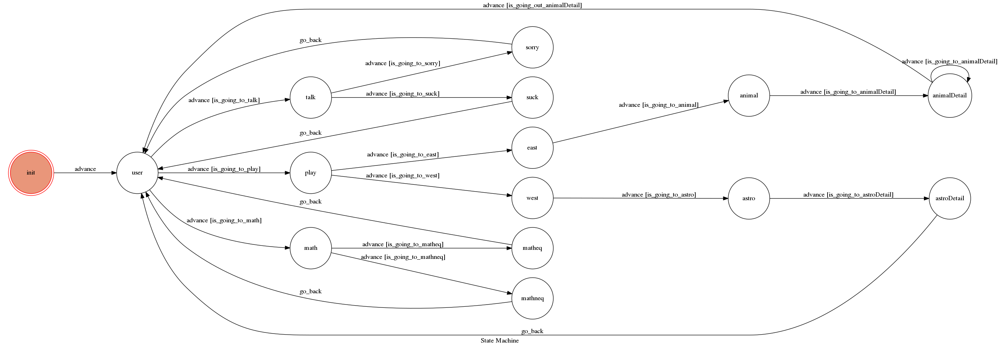

# TOC Project 2017

A telegram bot based on a finite state machine.

## Setup

### Prerequisite
* Python 3

#### Install Dependency
```sh
pip install -r requirements.txt
```

* pygraphviz (For visualizing Finite State Machine)
    * [Setup pygraphviz on Ubuntu](http://www.jianshu.com/p/a3da7ecc5303)

### Secret Data

`API_TOKEN` and `WEBHOOK_URL` in app.py **MUST** be set to proper values.
Otherwise, you might not be able to run your code.

### Run Locally
You can either setup https server or using `ngrok` as a proxy.

**`ngrok` would be used in the following instruction**

```sh
ngrok http 5000
```

After that, `ngrok` would generate a https URL.

You should set `WEBHOOK_URL` (in app.py) to `your-https-URL/hook`.

#### Run the sever

```sh
python3 app.py
```

## Finite State Machine


## Usage
The initial state when chatting is set to `user`. 
Moreover, I designed an actual initial state `init` that __accepts any input text__ to enter `user` state, in order to wake up the chatbot.

So you can simply wake the chatbot up by sending anythins like `Hello!` , `嗨～`.

Assume we're now in `user` state. Next, my bot will prompt a welcome message.
After that, user can input `+1`, `+2`, `+3` to chat with the bot.

Let's talk about the function of `+2` first, which is also the primary function of the bot.
It's for **fortune analysis** based on constellation and Chinese zodiac/animal sign. User can choose one of the both when chatting with the bot.

I write a **crawler to parse the fortune analysis website** to get the corresponding response for different user. Also use `reply_photo()` to interact
with the users. 

As for the function of `+1` or `+3` in `user` state, User can interact with the bot for fun.
 
## Author
[Ryan Wang](https://github.com/ryanwang522)
